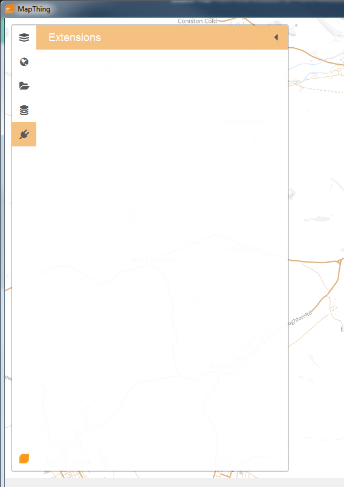
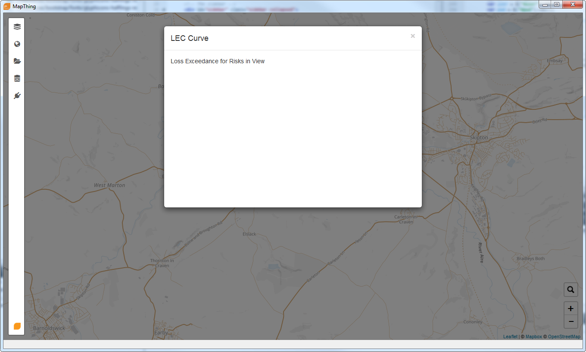

.. developer

MapThing for Developers
=======================

Extending MapThing
==================

MapThing can be extended with plugins. Plugins are the primary method by which MapThing functionality should be improved (rather than
development on mapthing itself). As such, MapThing imposes very little constraints on what a plugin can do and intentionally
exposes almost all functionality for the plugin to use. 

MapThing plugins should provide an javascript/html front-end using the QtWebKit Bridge in the same manner as MapThing itself. Javascript code will have
full access to the MapThing DOM and libraries (more details later). 

A plugin will consist of 5 main components:

1. The plugin interface implementation. This is a small class which inherits from MapThings' ``PluginInterface`` (in ``plugininterface.h``) and implements the methods declared by the interface. This is all that is required for
   mapthing to recognise and use the plugin. 
2. Javascript code which will setup the plugins' user interface in the mapthing window. 
3. A `Bridge` class which facilitates communication between Javascript and the C++ backend. See the `Accessing QObjects` section of `this page <http://doc.qt.io/qt-5/qtwebkit-bridge.html>`_.
4. A `Worker` class which will pass messages from the `Bridge` to the underlying logic. This object will be moved to a separate thread by MapThing in order to keep the UI responsive.
5. The logic code of the application. This would normally be compiled as a separate library and provides all the calculation logic of the plugin.

The following diagram shows how the plugin components interact

.. figure:: ../img/pluginarch.png
   
   MapThing plugin components. The worker class is placed in a separate thread to the bridge and front end. 

As the ``Bridge`` and ``Worker`` classes will be run in separate threads, it is crucial that they communicate via the `Qt Signal/Slot system <http://doc.qt.io/qt-5/signalsandslots.html>`_ in order to keep the GUI responsive. 

PluginInterface
---------------

Below is the definition of the plugin interface which needs to be implemented by any MapThing plugin.

.. cpp:class:: PluginInterface
   
   Represents a MapThing plugin and should be implemented by any MapThing plugin. It provides the front end, bridge and worker objects to MapThing.
      
.. cpp:function:: QString PluginInterface::initialiseUi(QProgressBar *)

   Creates the javascript necessary to create the plugin UI and returns it as a QString. ``progressBar`` is a pointer to the main windows ``QProgressBar`` which can be displayed in the status bar and used to provide progress updates on long running jobs
   
.. cpp:function:: QString getUiSetupFunc()
   
   Returns the name of the javascript function which will create the user interface when the plugin is launched.
   
.. cpp:function:: QString getName()
 
   Return the name of the plugin, formatted for human consumption :D
   
.. cpp:function:: QObject * getBridgeObject()

   Returns the C++ object which implements the ``Bridge`` class between the Javascript UI and the ``Worker`` class.
   
.. cpp:function:: QString getBridgeObjectName()

   Returns a QString representing the name of the ``Bridge`` object. This is the name that should be used within Javascript code to access the Bridge. E.g. (in javascript) ``BRIDGE.someMethod()``.

.. cpp:function:: QObject * getWorkerObject()

   Returns the C++ object (inheriting from QObject) which implements the ``Worker`` class to communicate between the ``Bridge`` and the backend logic
   
As can be seen, the ``PluginInterface`` does little more than initialise a couple of objects and strings and provides them to MapThing.
The ``Worker`` and ``Bridge`` object currently have no interface to implement as MapThing does not use these objects directly at all. It is up
to the developer to decide how these objects should interact. They may even be ``NULL`` if your plugin is implemented entirely in javascript!    

Javascript Front End
--------------------

Implementing the GUI interface will probably take up most development time. You will normally create a separate JS file which contains a function to create the interface and respond to events.

It is good practice to create functions within a namespace, to avoid naming conflicts. In Javascript, namespaces are usually given short, uppercase names which reflect the name of the library/application.
For example, the Leaflet library uses ``L`` as its namespace and all functions are available under this, e.g. ``L.DomUtil``.
MapThing uses ``MT`` for its namespace. 

Available libraries
###################

MapThing makes use of a few javascript librares and these are available for use in any plugin:

- Bootstrap (This is used throughout MapThing for creating and styling GUI elements)
- JQuery (For DOM manipulation)
- Chart.js
- Leaflet (although interaction with the map will often be done via the ``MT.MapController`` instance of the main map)

Where to create the GUI
#######################

When your plugin is registered, a button will be placed in the plugin sidebar panel so that your plugin can be launched. When the button is clicked, this will call
the `setup function` as described in the ``PluginInterface``. This setup function should create the plugin GUI within the mapthing interface

While it is theoretically possible to create the plugin GUI anywhere on the MapThing interface and even remove core MapThing DOM elements,
this may break key MapThing functionality. Stricter rules on usage of the MapThing DOM may be implemented in the future, but for now the following guidelines
are available.

1. The `Sidebar UI Area`

You can use the plugin sidebar itself to implement some or all of the GUI. That is this area:

   The plugin sidebar. The sidebar in the image is empty, indicating no plugins available. 
   
The ``div`` element under which you can place your own GUI elements has the following id: ``sb-plugin-area``. 
You should clear the ``div`` of existing elements and then add your own. `Note: Utility functions to ease this process will be added, see `T1242 <http://10.0.0.11/T1242>`_.`

2. Modal Windows

`NOTE: This section is in progress and will be updated when the modal functionality is finalised`.

You can create a modal window using the ``createModal`` function. This will return the DOM element under which you can add GUI elements.
A modal window looks like this:

   A modal window. The window can be resized and any normal HTML element added to it.
   
The window has a title (although this can of course be removed) and a `body` in which you may append elements. It is possible to resize the window
although currently MapThing offers no easy-access method for doing this. 
The modal window is created using bootstrap and the `documentation explains how to use the windows <http://getbootstrap.com/javascript/#modals>`_.

While a modal window is displayed, the user cannot interact with the map or sidebar.

Javascript API
##############

MapThing javascript functions exist under the ``MT`` namespace. Functions useful for plugin development are documented below

Global Methods
++++++++++++++

.. js:function:: MT.getMap([id])
   
   Retrieves the ``MapController`` object for a specific map container element, allowing the caller to manipulate the underlying Leaflet map.
   
   :param string id: The id of the map element. If not set, the function will return the main ``MapController`` instance
   :returns: The ``MapController`` object for the map. This contains the Leaflet ``map`` instance.

.. js:function:: MT.showMessage(msg, title)

   Show a message in a small popup modal. Typically used for conveying error messages or important information. 
   
   :param string msg: The message body
   :param string title: The title of the window
  
.. js:function:: MT.Dom.createModal(content, [title])

   Creates a modal bootstrap window and returns the `.modal-body` div; Add the contents of the window to this element.
   The modal window overlays the map area and the rest of the MapThing GUI is inactive while the window is displayed. 

   :param content: The content of the window
   :param string title: The title of the window
   :returns: The DOM node for the `.modal-body` element of the window

MapController
+++++++++++++

.. js:class:: MT.MapController([id])
      
      Creates a new ``MapController`` object which adds a map to the element with the given `id`.
      It is *not* reccomended to create this object directly as it will essentially create a clone of the MapThing window within 
      the given element.  
      Instead, use ``MT.getMap`` to get a handle on the main ``MapController`` instance and call methods on that.

.. js:function:: MT.MapController.disable()

   Disable all map interaction
   
.. js:function:: MT.MapController.enable()

   Enable map interaction
   
.. js:function:: MT.MapController.addWmsOverlay()
   
   Add a WMS layer to the map. 
   `NOTE: Currently this function attempts to take the WMS parameters from the WMS sidebar on the GUI. A task has been raised to make this more generic.`
   
.. js:function:: MT.MapController.addOverlay(layer, name)

   Add a Leaflet layer to the map
   
   :param ILayer layer: An object which implements the Leaflet `ILayer` interface
   :param string name: The name of the layer
   
.. js:function:: MT.MapController.removeOverlay(displayName)

   Remove an overlay layer from the map
   
   :param string displayName: The name of the layer, as given to ``addOverlay``

DataLayer
+++++++++

.. js:class:: MT.DataLayer(mapCt)

   Creates a layer of clustered markers and adds it as an overlay to the map defined by ``mapCt``
   
   :param MapController mapCt: An instance of ``MT.MapController`` in which the cluster layer should be added
   
.. js:function:: MT.DataLayer.addRiskMarker(lat, lon, [tiv])

   Add a marker to the layer
   
   :param double lat: The latitude of the marker
   :param double lon: The longitude of the marker

.. js:function:: MT.DataLayer.processView()

   Refresh the display of the marker layer. Must be called when new markers are added to the layer.

CsvLayer
++++++++

.. js:class:: MT.CsvLayer(mapCt, path)

   Implements ``MT.DataLayer`` for CSV files containing lat/lon coords. 
   The CSV file must contain a `Lat` column and a `Lon` column. Reading of the CSV file is handled by the C++ backend,
   so this class is only useful in the MapThing desktop application. 
   
   :param MapController mapCt: The ``MapController`` instance in which to create the layer
   :param string path: The path to the input CSV file
   
The Bridge class
----------------

The `Bridge` class faciliates communication between the javascript front-end and the C++ backend. 
MapThing will automatically make the Bridge class available in the javascript environment with a name of your choosing. 

When implementing the ``PluginInterface``, the function ``getBridgeObject`` should return a pointer to an instance of your `Bridge` class.
The function ``getBridgeObjectName`` should return the desired name of your `Bridge` object. This name is what you will use to call methods on the `Bridge` object 
in your javascript code.

At its' simplest, the `Bridge` class is a class which inherits from ``QObject`` and implements some signals. For example::

   class Bridge : public QObject
   {
       Q_OBJECT
   public:
       explicit Bridge(QObject *parent = 0);
       ~Bridge();
   
  
   signals:
       void calculatePressed();  
   };

The above class implements a single `signal` called ``calculatePressed``. This signal is callable by the javascript front end.

In the ``PluginInterface`` implementation, you should connect this signal to a corresponding slot (or signal) in the `Worker` class. 

For example:: 

   QObject * PluginInterface::getBridgeObject(){
      
      Bridge *bridge = new Bridge();      
      connect(bridge, &Bridge::calculatePressed, this.worker, &Worker::doCalculation);
      
      return bridge;
       
   
   }

   QString PluginInterface::getBridgeObjectName(){
      return "MyBridge";   
   }

In the javascript code, you may have a button press function handler like so::

      function onButtonPress(){      
         MyBridge.calculatePressed();
      }

In the above, calling ``onButtonPress`` will cause the function ``doCalculation`` to be called in the ``Worker`` class.

The Worker Class
--------------------

Initialisation Order
---------------------

When your plugin is loaded, it will be initialised in the following order:

1. The ``Bridge`` object is requested and added to the main ``QWebView`` object of MapThing
2. The ``Worker`` object is requested and moved to the worker thread
3. The javascript code is requested and added to the web page
4. A `plugin launch` button is added to the plugin sidebar, with a callback function to the function provided by ``getUiSetupFunction``.

This means that:

- The ``Bridge`` object should not attempt to communicate with ``Worker`` or the javascript when it is initialised.
- The ``Worker`` object should not attempt to communicate with the javascript (e.g. by invoking a signal on the ``Bridge`` object) when it is initialised.
- The javascript code may call the ``Bridge`` object, although this is bad practice; normally nothing would be executed until the user presses the plugin launch button

